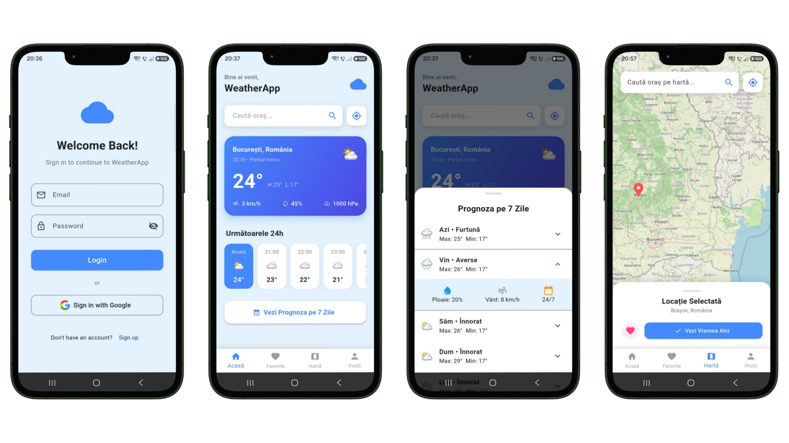

# WeatherApp

WeatherApp is a Flutter application for checking current weather conditions,
hourly forecasts, and seven-day forecasts for locations around the world.

> The project is currently in beta. Feedback and bug reports are welcome.

## Screenshots



## Features

- Weather based on the device's GPS location
- City search and interactive map selection
- Current conditions, hourly forecast, and seven-day forecast
- Email/password and Google authentication with Firebase
- Favorite locations synchronized through Cloud Firestore
- Local weather cache for faster startup and offline fallback
- Android support and initial iOS configuration

## Download

Download the latest Android APK from the
[GitHub Releases](https://github.com/gabiray/weatherapp/releases) page.

Android might ask for permission to install apps from your browser or file
manager because the APK is distributed outside Google Play.

## Technology

- [Flutter](https://flutter.dev/)
- [Firebase Authentication](https://firebase.google.com/docs/auth)
- [Cloud Firestore](https://firebase.google.com/docs/firestore)
- [Open-Meteo](https://open-meteo.com/) for weather and geocoding data
- [OpenStreetMap](https://www.openstreetmap.org/) for map tiles
- [Nominatim](https://nominatim.org/) for reverse geocoding

## Run Locally

Install Flutter and connect an Android device or start an emulator. Then run:

```bash
flutter pub get
flutter run
```

Check the project before building:

```bash
flutter analyze
```

## Firebase Setup

The application uses Firebase Authentication and Cloud Firestore. When using
your own Firebase project:

1. Register Android and iOS applications in Firebase.
2. Enable Email/Password and Google authentication.
3. Create a Cloud Firestore database.
4. Run `flutterfire configure`.
5. Add the Android debug and release SHA-1/SHA-256 fingerprints.
6. Deploy the rules from `firestore.rules`.

Firebase client configuration files contain public app identifiers. Never
commit service-account credentials, signing keys, `key.properties`, or `.env`
files containing secrets.

## Build an Android Release

A local Android signing key and `android/key.properties` are required:

```bash
flutter build apk --release
```

The generated APK is available at:

```text
build/app/outputs/flutter-apk/app-release.apk
```

## Project Structure

```text
lib/
  services/       Firebase authentication and favorites
  view/screens/   Application screens
  main.dart       Firebase initialization and authentication gate
```

## Permissions

WeatherApp requests location access to show weather for the user's current
position. If location access is unavailable, the app uses cached weather data
or Bucharest as a fallback.
